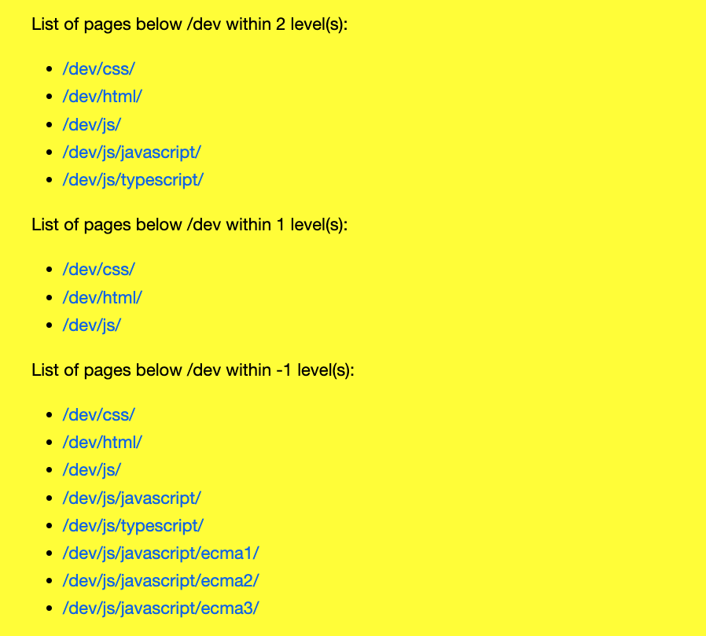

# My AEM Franklin playground

Website created by following the AEM Franklin tutorial:
https://www.hlx.live/developer/tutorial

It features a list block, enabling an author to dynamically display a list of pages, based on a root path and a level definition.

Google doc:  


Web site:  


JS code:  
[list.js](blocks/list/list.js)

## Environments
- Preview: https://main--helix-project-1--jckautzmann.hlx.page/
- Live: https://main--helix-project-1--jckautzmann.hlx.live/

## Installation

```sh
npm i
```

## Tests

```sh
npm tst
```

## Local development

1. Create a new repository based on the `helix-project-boilerplate` template and add a mountpoint in the `fstab.yaml`
1. Add the [helix-bot](https://github.com/apps/helix-bot) to the repository
1. Install the [Helix CLI](https://github.com/adobe/helix-cli): `npm install -g @adobe/helix-cli`
1. Start Helix Pages Proxy: `hlx up` (opens your browser at `http://localhost:3000`)
1. Open the `{repo}` directory in your favorite IDE and start coding :)
