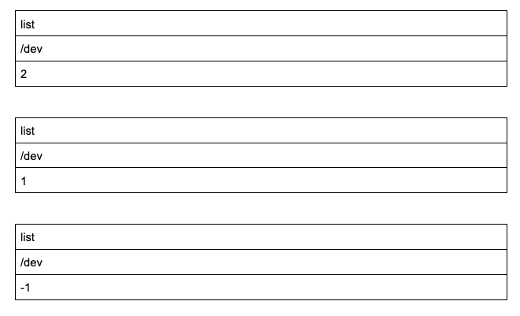

# JC's playground with Helix

Website created by following the Helix [tutorial](https://www.hlx.live/developer/tutorial).

## List Block (Component)

It features a (very) basic list block, enabling an author to display a dynamic list of pages, based on a root path and the level of descendant pages.  

#### Site visitor

https://main--helix-project-1--jckautzmann.hlx.live/:


#### Site author

drive.google.com:



#### Site developer

* source code: [list.js](blocks/list/list.js)
* index created according to the [index reference page](https://www.hlx.live/developer/indexing).

## Environments
- Preview: https://main--helix-project-1--jckautzmann.hlx.page/
- Live: https://main--helix-project-1--jckautzmann.hlx.live/

## Installation

```sh
npm i
```

## Tests

```sh
npm tst
```

## Local development

1. Create a new repository based on the `helix-project-boilerplate` template and add a mountpoint in the `fstab.yaml`
1. Add the [helix-bot](https://github.com/apps/helix-bot) to the repository
1. Install the [Helix CLI](https://github.com/adobe/helix-cli): `npm install -g @adobe/helix-cli`
1. Start Helix Pages Proxy: `hlx up` (opens your browser at `http://localhost:3000`)
1. Open the `{repo}` directory in your favorite IDE and start coding :)
